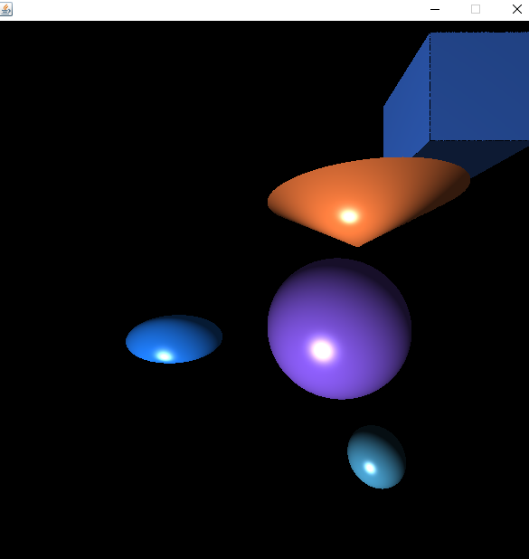

# Ray-Tracer

Features:
1. Blinn-Phong Model for diffuse, ambient, and specular lighting.
2. Implemented Ray-Object intersection for Spheres, Rectangular Prisms, Ellipsoids, Cones, and any Quadric Surface.

I created a step-by-step explanation for the mathematics of ray-tracing with the example of a Sphere:
[Math-of-Ray-Tracing](https://docs.google.com/document/d/1pplt6SFhVEGGjcQi-_dVIWDbhQ6yXIRQTxh-nl3qr9U/edit?usp=sharing)
I applied the same technique to derive the other 3D shapes. 

Future Steps:
1. Getting the rays to bounce off multiple objects
2. Implementing Refraction
